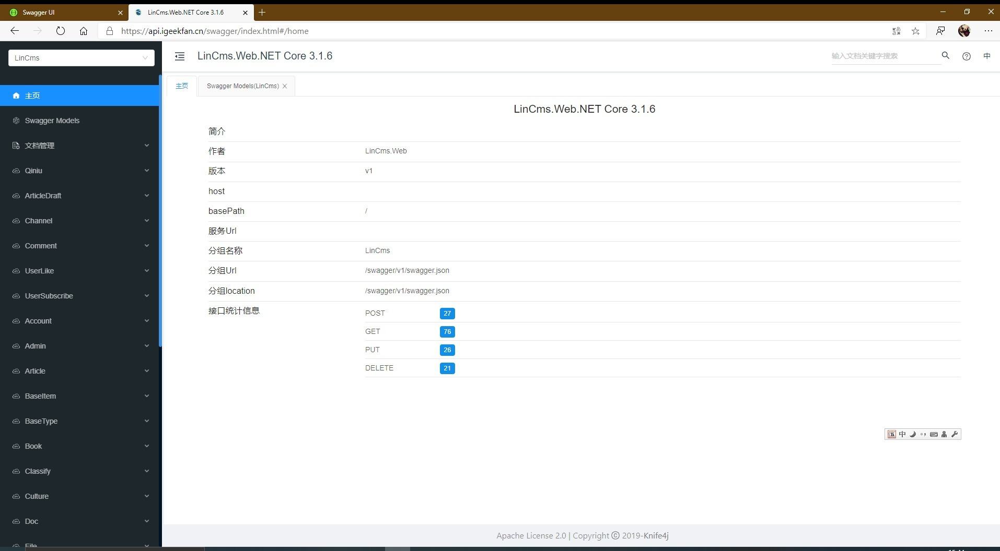

# IGeekFan.AspNetCore.Knife4jUI

一个swagger ui 库：**[knife4j UI](https://gitee.com/xiaoym/knife4j)**，支持 .NET Core3.0+或.NET Standard2.0。


[](https://www.nuget.org/packages/IGeekFan.AspNetCore.Knife4jUI) [](https://www.nuget.org/stats/packages/IGeekFan.AspNetCore.Knife4jUI?groupby=Version) [](https://raw.githubusercontent.com/luoyunchong/IGeekFan.AspNetCore.Knife4jUI/master/LICENSE.txt)

## 相关依赖项
### [knife4j](https://gitee.com/xiaoym/knife4j/tree/master/knife4j-vue)
- knife4j-vue
### [Swashbuckle.AspNetCore](https://github.com/domaindrivendev/Swashbuckle.AspNetCore)
- Swashbuckle.AspNetCore.Swagger
- Swashbuckle.AspNetCore.SwaggerGen

## Demo
- [Basic](https://github.com/luoyunchong/IGeekFan.AspNetCore.Knife4jUI/blob/master/test/Basic)
- [Knife4jUIDemo](https://github.com/luoyunchong/IGeekFan.AspNetCore.Knife4jUI/blob/master/test/Knife4jUIDemo)

## 📚 快速开始

### 🚀安装包

以下为使用Swashbuckle.AspNetCore.Swagger底层组件

1.Install the standard Nuget package into your ASP.NET Core application.

```
Package Manager : 

Install-Package Swashbuckle.AspNetCore.Swagger
Install-Package Swashbuckle.AspNetCore.SwaggerGen
Install-Package IGeekFan.AspNetCore.Knife4jUI

OR

CLI :

dotnet add package Swashbuckle.AspNetCore.Swagger
dotnet add package Swashbuckle.AspNetCore.SwaggerGen
dotnet add package IGeekFan.AspNetCore.Knife4jUI
```

2.In the ConfigureServices method of Startup.cs, register the Swagger generator, defining one or more Swagger documents.

```
using Microsoft.AspNetCore.Mvc.Controllers
using Microsoft.OpenApi.Models;
using Swashbuckle.AspNetCore.SwaggerGen;
using IGeekFan.AspNetCore.Knife4jUI;
```
### 🚁 ConfigureServices

3.服务配置，CustomOperationIds和AddServer是必须的。
```
   services.AddSwaggerGen(c =>
    {
        c.SwaggerDoc("v1",new OpenApiInfo{Title = "API V1",Version = "v1"});
        c.AddServer(new OpenApiServer()
        {
            Url = "",
            Description = "vvv"
        });
        c.CustomOperationIds(apiDesc =>
        {
            var controllerAction = apiDesc.ActionDescriptor as ControllerActionDescriptor;
            return  controllerAction.ControllerName+"-"+controllerAction.ActionName;
        });
    });
```

### 💪 Configure
4. 中间件配置
```
app.UseSwagger();

app.UseKnife4UI(c =>
{
    c.RoutePrefix = ""; // serve the UI at root
    c.SwaggerEndpoint("/v1/api-docs", "V1 Docs");
});

app.UseEndpoints(endpoints =>
{
    endpoints.MapControllers();
    endpoints.MapSwagger("{documentName}/api-docs");
});
```

5.更多功能

为文档添加注释 在项目上右键--属性--生成


在AddSwaggerGen方法中添加如下代码

```
c.IncludeXmlComments(Path.Combine(AppContext.BaseDirectory, "SwaggerDemo.xml"),true);
```
 最后一个参数设置为true，代表启用控制器上的注释

运行后如看不到控制器上注释显示，请点开文档管理->个性化设置，开启分组tag显示description说明属性


### NSwag.AspNetCore
（请参考目录test/WebSites/NSwag.Swagger.Knife4jUI）

```
public void ConfigureServices(IServiceCollection services)
 {
    // 其它Service
     services.AddOpenApiDocument();
 }
```

```
public void Configure(IApplicationBuilder app, IWebHostEnvironment env)
{
            // 其它 Use
          app.UseOpenApi();
          app.UseKnife4UI(c =>
         {
               c.RoutePrefix = "";
               c.SwaggerEndpoint("/swagger/v1/swagger.json");
          });
}
```

即可使用 Knife4jUI

### 🔎 效果图
运行项目，打开 https://localhost:5001/index.html#/home


### 更多配置请参考

- [https://github.com/domaindrivendev/Swashbuckle.AspNetCore](https://github.com/domaindrivendev/Swashbuckle.AspNetCore)


### 更多项目

- [https://api.igeekfan.cn/swagger/index.html](https://api.igeekfan.cn/swagger/index.html)
- [https://github.com/luoyunchong/lin-cms-dotnetcore](https://github.com/luoyunchong/lin-cms-dotnetcore)

